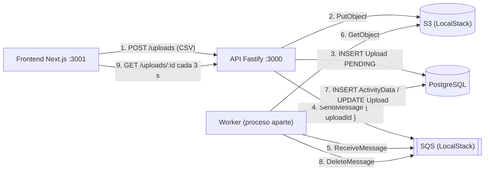

# CarbonBox: procesamiento asíncrono de documentos

Sistema que permite subir archivos CSV con datos de actividad, procesarlos de forma **asíncrona** mediante una cola de mensajes y consultar los resultados cuando el procesamiento termina.

La API recibe el archivo, lo guarda en S3, registra el upload en estado `PENDING` y encola un mensaje, y responde de inmediato. Un **worker** independiente consume la cola, descarga y valida el CSV, guarda las filas válidas y marca el upload como `COMPLETED` o `FAILED`. El frontend consulta el estado cada 3 segundos hasta que el proceso termina.

---

## Stack

| Parte | Tecnologías |
|---|---|
| Backend | Node.js, TypeScript, Fastify 4, Prisma 5, Awilix, csv-parse, AWS SDK v3 |
| Frontend | Next.js 16 (App Router), React 19, TanStack Query 5, Axios, Tailwind CSS 4, shadcn/ui |
| Infraestructura | Docker Compose con PostgreSQL 15 y LocalStack (S3 + SQS) |
| Arquitectura | DDD, Clean Architecture, CQRS, patrón Either, inyección de dependencias |

---

## Requisitos previos

- **Node.js 20.9 o superior** (lo exige Next.js 16) y npm.
- **Docker Desktop** con Docker Compose.
- **Una cuenta gratuita de LocalStack** y su *Auth Token*: la imagen `localstack/localstack:latest` no arranca sin él (termina con `License activation failed`, código 55). Se obtiene en [app.localstack.cloud](https://app.localstack.cloud).
- Puertos libres: `3000` (API), `3001` (frontend), `5432` (PostgreSQL) y `4566` (LocalStack).

---

## Puesta en marcha

Se necesitan **tres terminales** para la aplicación (API, worker y frontend), además de Docker.

### 1. Clonar el repositorio

```bash
git clone https://github.com/Jandreyserna/carbonBox.git
cd carbonBox
```

### 2. Variables de entorno

Hay tres archivos, cada uno con su plantilla `.example`:

```bash
cp .env.example .env                              # raíz: token de LocalStack
cp backend/.env.example backend/.env              # API y worker
cp frontend/.env.example frontend/.env.local      # frontend
```

En PowerShell, usa `Copy-Item` en lugar de `cp` (por ejemplo, `Copy-Item .env.example .env`).

Luego edita el `.env` de la raíz y pega tu token:

```
LOCALSTACK_AUTH_TOKEN=ls-xxxx-xxxx
```

Los valores de `backend/.env.example` y `frontend/.env.example` ya sirven para desarrollo local sin cambios:

| Variable | Archivo | Para qué sirve |
|---|---|---|
| `DATABASE_URL` | backend | Conexión a PostgreSQL |
| `AWS_ENDPOINT`, `AWS_REGION`, `AWS_ACCESS_KEY_ID`, `AWS_SECRET_ACCESS_KEY` | backend | Cliente de AWS apuntando a LocalStack (las credenciales `test` son ficticias) |
| `S3_BUCKET_NAME` | backend | Bucket donde se guardan los CSV |
| `SQS_QUEUE_URL` | backend | Cola de procesamiento |
| `PATH_PREFIX` | backend | Prefijo de las rutas (`/api/v1/uploads`) |
| `NEXT_PUBLIC_API_URL` | frontend | URL base de la API (`http://localhost:3000/api/v1`) |

### 3. Levantar la infraestructura

Desde la raíz del repositorio:

```bash
docker compose up -d --wait
```

`--wait` espera a que PostgreSQL y LocalStack estén sanos. Al arrancar, LocalStack ejecuta `backend/scripts/localstack-init.sh`, que crea el bucket `document-processing-uploads` y la cola `document-processing-queue`. Para comprobarlo:

```bash
docker compose logs localstack | grep "\[init\]"
```

Debe aparecer `[init] Cola document-processing-queue lista`. En PowerShell, cambia `grep` por `Select-String`.

### 4. Backend (API)

```bash
cd backend
npm install
npx prisma migrate deploy      # crea las tablas
npm run prisma:generate        # genera el cliente de Prisma
npm run dev
```

La API queda en `http://localhost:3000`. Para comprobarlo, abre `http://localhost:3000/api/v1/uploads/summary`, que debe responder un JSON con los conteos.

### 5. Worker (otra terminal)

```bash
cd backend
npm run worker
```

Debe mostrar `Worker escuchando la cola cada 3000 ms...`. Sin el worker, los uploads se quedan en `PENDING` para siempre.

### 6. Frontend (otra terminal)

```bash
cd frontend
npm install
npm run dev
```

Abre `http://localhost:3001`.

### Resumen de servicios

| Servicio | Comando | URL |
|---|---|---|
| PostgreSQL + LocalStack | `docker compose up -d --wait` | `localhost:5432`, `localhost:4566` |
| API | `npm run dev` (en `backend/`) | `http://localhost:3000/api/v1` |
| Worker | `npm run worker` (en `backend/`) | — |
| Frontend | `npm run dev` (en `frontend/`) | `http://localhost:3001` |

---

## Cómo probarlo

El repositorio incluye [`docs/sample-data.csv`](docs/sample-data.csv), un archivo de ejemplo de 50 filas.

### Desde la interfaz

1. Abre `http://localhost:3001`: el **dashboard** muestra el total de uploads y cuántos están completados, en proceso y fallidos.
2. Ve a **Nuevo upload** y arrastra o selecciona `docs/sample-data.csv`. Si eliges un archivo que no sea `.csv`, el formulario lo rechaza antes de enviarlo.
3. Durante la subida se ve una barra de progreso, y al terminar la aplicación redirige al **detalle** del upload.
4. En el detalle, el estado pasa de *Pendiente* a *Completado* sin recargar la página: el frontend consulta la API cada 3 segundos mientras el estado sea `PENDING` o `PROCESSING`, y deja de hacerlo al terminar. Al completarse aparecen los conteos de filas y la tabla de resultados.
5. En **Uploads** aparece el archivo con su badge de estado (amarillo: pendiente, azul: procesando, verde: completado, rojo: fallido), paginado de 10 en 10.

**Qué observar:** en la pestaña *Network* del navegador, las peticiones a `GET /uploads/:id` se repiten cada 3 segundos y se detienen cuando el estado cambia a `COMPLETED` o `FAILED`. Para ver el polling con calma, detén el worker, sube un archivo (queda en `PENDING`) y vuelve a arrancar el worker.

### Desde la API

```bash
# Subir el archivo (devuelve { id })
curl -X POST http://localhost:3000/api/v1/uploads \
  -F "file=@docs/sample-data.csv;type=text/csv" \
  -F "userId=user-123"

# Consultar el estado (repetir hasta que status sea COMPLETED)
curl http://localhost:3000/api/v1/uploads/<id>

# Ver las filas procesadas
curl http://localhost:3000/api/v1/uploads/<id>/results
```

### Endpoints

| Método | Ruta | Descripción | Respuesta |
|---|---|---|---|
| `POST` | `/api/v1/uploads` | Sube un CSV (multipart: `file`, `userId`). Máximo 20 MB | `201` `{ id }` |
| `GET` | `/api/v1/uploads` | Lista paginada. Query: `page` (1), `limit` (10, máx. 100), `userId` (`user-123`) | `{ data, total, page, limit }` |
| `GET` | `/api/v1/uploads/summary` | Conteos por estado para el dashboard. Query: `userId` | `{ total, pending, processing, completed, failed }` |
| `GET` | `/api/v1/uploads/:id` | Estado del upload | `{ id, fileName, status, totalRows, processedRows, failedRows, errorMessage, createdAt, ... }` |
| `GET` | `/api/v1/uploads/:id/results` | Filas válidas guardadas | `{ data: [{ category, amount, unit, date }] }` |

Los errores responden `{ "error": "mensaje" }` con `400` (validación), `404` (no encontrado) o `500` (error inesperado).

### Formato del CSV

```csv
category,amount,unit,date
Electricity,150.5,kWh,2024-01-15
Natural Gas,75.2,m3,2024-01-16
```

Validaciones por fila: `category` y `unit` no vacíos, `amount` numérico y positivo, y `date` una fecha válida. Una fila inválida **no** hace fallar el archivo completo: se cuenta en `failedRows` y el resto se procesa. El nombre del archivo debe terminar en `.csv`.

---

## Arquitectura

### Flujo del sistema



La API responde en el paso 4, sin esperar a que el CSV se procese. El trabajo pesado ocurre en el worker, un proceso de Node.js separado que no bloquea el servidor HTTP y que podría escalarse de forma independiente.

### Bounded context y capas (backend)

Todo el dominio vive en el bounded context `document-processing`, organizado según Clean Architecture. Las dependencias apuntan hacia adentro: `presentation` e `infrastructure` dependen de `application`, que depende de `domain`, y `domain` no depende de nada.

```
backend/src/
├── main/                      # Composición: Fastify, contenedor de DI, rutas
├── workers/                   # FileProcessingWorker: consume la cola
├── shared/                    # Contratos comunes: Either, AppError, AggregateRoot,
│                              # ValueObject, BaseController, ICommandHandler, IQueryHandler
└── document-processing/
    ├── domain/                # Entidades (Upload, ActivityData), value objects
    │                          # (FileName, UploadStatus) e interfaces de repositorio
    ├── application/           # Commands, queries, sus handlers y servicios
    │                          # (CsvParserService, FileProcessingService)
    ├── infrastructure/        # Prisma (repositorios y mappers), S3, SQS y registro en Awilix
    └── presentation/          # Controllers y rutas HTTP
```

### Patrones aplicados

- **DDD.** `Upload` es el aggregate root y controla sus transiciones de estado (`markAsProcessing`, `markAsCompleted`, `markAsFailed`). `FileName` y `UploadStatus` son value objects que se validan al crearse. Los repositorios son interfaces en `domain` implementadas con Prisma en `infrastructure`, y los mappers traducen entre filas de la base de datos y entidades.
- **CQRS.** Las escrituras son commands (`CreateUploadCommand`, `ProcessFileCommand`) y las lecturas son queries (`GetUploadByIdQuery`, `ListUploadQuery`, `GetUploadResultsQuery`, `GetUploadsSummaryQuery`), cada una con su handler.
- **Either.** Todos los handlers devuelven `Either<Error, Result>`, y los controllers no usan `try/catch`. `BaseController` traduce un `Left` de tipo `AppError` (`ValidationError` → 400, `NotFoundError` → 404) a la respuesta HTTP, y las excepciones inesperadas llegan al `setErrorHandler` global de Fastify, que responde 500.
- **Inyección de dependencias.** Awilix en modo `CLASSIC` inyecta por nombre de parámetro del constructor, así las clases de dominio y aplicación no conocen el contenedor. Cada bounded context registra sus piezas en `infrastructure/dependency-injection`.

### Frontend

```
frontend/
├── app/                       # Rutas (App Router): /, /uploads, /uploads/new, /uploads/[id]
├── features/document-processing/
│   ├── api/                   # Llamadas con Axios y hooks de React Query
│   ├── components/            # Dashboard, UploadForm, UploadList, UploadDetail, ResultsTable...
│   ├── lib/                   # Metadatos de estado y validación del CSV
│   └── types/                 # Tipos de las respuestas de la API
└── shared/                    # Layout, componentes de UI (shadcn/ui), cliente HTTP, utilidades
```

Las páginas de `app/` solo componen. La lógica vive en `features/`, y React Query gestiona caché, estados de carga y error, y el polling (`refetchInterval` de 3 s mientras el estado sea `PENDING` o `PROCESSING`).

---

## Decisiones técnicas

- **LocalStack en lugar de un mock de la cola.** El código usa las APIs reales de S3 y SQS, así que funcionaría contra AWS cambiando solo el endpoint y las credenciales. El costo es depender de Docker y de un token de LocalStack.
- **El mensaje de la cola solo lleva el `uploadId`.** El CSV ya está en S3 y el estado en PostgreSQL, así que no hace falta duplicarlos (además, SQS limita los mensajes a 256 KB).
- **El mensaje se borra de la cola solo después de actualizar el estado.** Si el worker se cae a mitad de proceso, SQS vuelve a entregar el mensaje cuando vence el *visibility timeout*.
- **Validación por fila, no todo o nada.** Encaja con los campos `totalRows`, `processedRows` y `failedRows`: un archivo con algunas filas malas se procesa igual y reporta cuántas fallaron.
- **El nombre del archivo se valida antes de subirlo a S3**, para no dejar objetos huérfanos en el bucket cuando la validación falla.
- **Endpoint `/uploads/summary`.** El dashboard obtiene los conteos con un único `groupBy` en la base de datos, en lugar de descargar la lista completa y contar en el navegador.
- **Controllers de una sola acción.** Un controller por caso de uso (`CreateUploadController`, `GetUploadByIdController`...), alineado 1:1 con los handlers de CQRS.
- **shadcn/ui en el frontend.** Los componentes base (tabla, tarjetas, badges, sidebar) se generan en `shared/components/ui` y se adaptan, en vez de construir la interfaz desde cero.

---

## Limitaciones conocidas

- **El worker no se recupera de errores de conexión.** El bucle de polling no captura excepciones: si SQS no responde (por ejemplo, al reiniciar LocalStack), el proceso del worker termina y `ts-node-dev` queda esperando cambios. Hay que reiniciar `npm run worker`.
- **Consultas superpuestas a la cola.** El worker usa `setInterval` cada 3 s con *long polling* de hasta 10 s, así que puede haber varias peticiones de recepción en paralelo. No duplica trabajo gracias al *visibility timeout*, pero no es un control de concurrencia explícito.
- **Sin Dead Letter Queue ni reintentos con backoff.** Un mensaje que falla siempre se reintenta indefinidamente.
- **Sin idempotencia en el procesamiento.** Si el worker se cae después de guardar las filas pero antes de borrar el mensaje, al reprocesarlo se duplicarían los registros de `ActivityData`.
- **La fecha no se valida estrictamente como `YYYY-MM-DD`.** Se acepta cualquier valor que JavaScript interprete como fecha válida.
- **Configuración.** No se usa Convict (`src/config` está vacío). Las variables se leen con `process.env`, y el `.env` se carga como efecto secundario de Prisma Client, no con `dotenv` explícito. El puerto 3000 y el origen de CORS (`http://localhost:3001`) están fijos en el código.
- **`POST /uploads` responde solo `{ id }`**, no `{ id, status, fileName, createdAt }`.
- **Sin autenticación.** Se asume un único usuario (`user-123`), como permite el enunciado.
- **LocalStack no persiste datos entre reinicios.** El script de inicio recrea el bucket y la cola, pero los archivos subidos antes del reinicio se pierden (los registros en PostgreSQL se conservan).
- **La barra del detalle es indeterminada.** El worker solo escribe los conteos de filas al terminar, así que no hay un porcentaje real mientras procesa.
- **Sin tests automatizados** todavía (Jest está instalado, pero no hay pruebas).
- **Solo la infraestructura corre en Docker.** La API, el worker y el frontend se ejecutan con npm.

---

## Solución de problemas

| Síntoma | Causa probable y solución |
|---|---|
| LocalStack termina con `License activation failed` (código 55) | Falta `LOCALSTACK_AUTH_TOKEN` en el `.env` de la raíz |
| Subir un archivo responde `500` | No existen el bucket o la cola. Revisa `docker compose logs localstack` o reinicia con `docker compose restart localstack` |
| El upload se queda en `PENDING` | El worker no está corriendo o se cayó: reinicia `npm run worker` |
| `Can't reach database server at localhost:5432` | PostgreSQL no está arriba: `docker compose up -d --wait` |
| `blocked by CORS policy` en el navegador | El frontend debe correr en el puerto 3001, o hay que reiniciar la API |
| `Cannot find module '@infrastructure/...'` | Ejecuta el backend con los scripts de npm, que registran `tsconfig-paths` |
| El frontend no ve la API (`NEXT_PUBLIC_API_URL` indefinida) | Crea `frontend/.env.local` y reinicia `npm run dev` |
| `EADDRINUSE` en el puerto 3000 o 3001 | Hay otra instancia corriendo; ciérrala |

---

## Scripts disponibles

**Backend (`backend/`)**

| Script | Descripción |
|---|---|
| `npm run dev` | API en modo desarrollo, con recarga automática |
| `npm run worker` | Worker en modo desarrollo |
| `npm run build` | Compila TypeScript a `dist/` |
| `npm start` / `npm run start:worker` | Ejecutan la API y el worker compilados |
| `npm run prisma:generate` | Genera el cliente de Prisma |
| `npm run prisma:migrate` | Crea y aplica migraciones al cambiar `schema.prisma` |

**Frontend (`frontend/`)**

| Script | Descripción |
|---|---|
| `npm run dev` | Servidor de desarrollo en el puerto 3001 |
| `npm run build` | Build de producción |
| `npm start` | Sirve el build en el puerto 3001 |
| `npm run lint` | ESLint |
